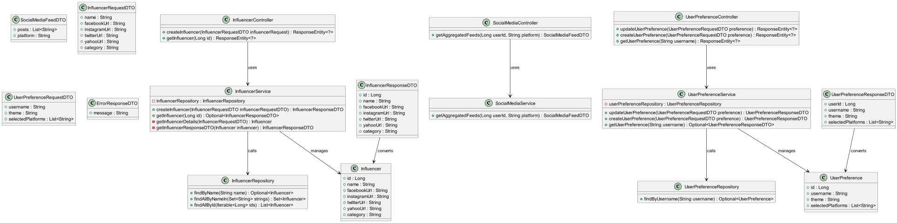
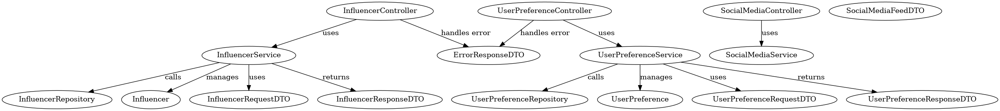

Social Media Aggregator - Architecture

1. Overview
   The Social Media Aggregator is a Spring Boot microservice designed to aggregate social media feeds based on user preferences. The service fetches data from various external platforms such as Facebook, Instagram, Twitter, and consolidates the results into a unified feed. This project demonstrates microservice-based architecture for scalable and maintainable applications, with core functionalities like handling user preferences, influencer data, and platform-specific feed aggregation.

2. Architecture Diagram

Explanation:
- Frontend (Client): Users interact with the system through a web or mobile app (or via Postman for API testing).
- Backend (Spring Boot): The application processes requests, manages user preferences, fetches and aggregates social media data.
- PostgreSQL Database(H2): Stores user preferences, influencers, and relationship data.
- External APIs: Fetches feeds from social media platforms such as Facebook, Twitter, Instagram, etc.

3. Core Design Principles

3.1 Modular Design
Each feature of the application, such as user preference management and social media feed aggregation, is encapsulated in a service. This helps to decouple components, making the system maintainable and scalable.

3.2 Single Responsibility Principle
Every class and component serves a single purpose:
- `SocialMediaService` focuses on fetching and aggregating social media feeds.
- *`UserPreferenceService` manages user-specific configurations.
- Repositories handle database interactions.

3.3 Testability
The system is designed with testability in mind. Dependencies are injected via Spring's `@Autowired` for easy mocking and unit testing.

3.4 Scalability
The architecture supports adding new social media platforms easily by extending the `fetchFeedFromPlatform()` method in the `SocialMediaService`. For example, adding TikTok or LinkedIn requires minimal changes.

4. Components and Modules

4.1 Backend (Spring Boot Application)
The backend serves as the business logic layer and integrates with the database and external APIs. It is divided into the following key services:

4.1.1 SocialMediaService
- Function: Aggregates social media feeds from multiple platforms.
- Key Method:
    - `getAggregatedFeeds(userId, platform)`: Fetches aggregated feeds for a specific user.
    - `fetchFeedFromPlatform(Influencer influencer, String platform)`: Simulates API calls to different social media platforms.

4.1.2 UserPreferenceService
- Function: Manages user preferences such as followed influencers and platform choices.
- Key Method:
    - `createUserPreference(UserPreferenceDTO preference)`: Saves user preferences.
    - `getUserPreference(Long userId)`: Retrieves user preferences from the database.

4.2 Database (PostgreSQL(H2))
- Role: Stores user preferences and influencer data in a normalized schema.
- Entities:
    - UserPreference: Contains preferences like theme and selected influencers.
    - Influencer: Stores information about influencers across platforms.

4.2.1 Database Schema
- Tables:
    - UserPreference: Contains user settings, linked to a list of influencer IDs.
    - Influencer: Contains influencer names, platforms, and IDs.

4.2.2 Relationships
- Many-to-Many: Users can follow multiple influencers, and an influencer can be followed by multiple users.

4.3 External Social Media APIs
- Role: The backend fetches influencer feeds from external APIs. For the current version, the calls are mocked.
- Platforms Supported:
    - Facebook
    - Instagram
    - Twitter
    - Yahoo (for demonstration purposes)

5. Data Flow

5.1 Fetching User Preferences
1. The client sends a request to fetch aggregated feeds.
2. The backend retrieves the user's preferences from the UserPreferenceRepository.
3. The SocialMediaService fetches feeds for influencers on the specified platform using `fetchFeedFromPlatform()`.

5.2 Fetching Aggregated Feeds
1. UserPreferenceService retrieves the list of influencers the user follows.
2. SocialMediaService iterates over each influencer and calls the respective platform’s API (mocked).
3. The aggregated feeds are compiled into a SocialMediaFeedDTO and returned to the client.

6. API Endpoints

6.1 User Preferences Management
- Create/Update User Preferences
    - Method: `POST /api/preferences`
    - Description: Allows creating or updating user preferences (theme, influencers, platform).
    - Request Body: `UserPreferenceDTO` (containing user ID, theme, influencers, etc.)

- Get User Preferences
    - Method: `GET /api/preferences/{userId}`
    - Description: Retrieves user preferences by their ID.

6.2 Fetch Aggregated Feeds
- Method: `GET /api/feeds?userId={userId}&platform={platform}`
- Description: Fetches social media feeds from the specified platform for the user.
- Response: Returns a `SocialMediaFeedDTO` containing the aggregated feed.

7. Error Handling
- User Preferences Not Found: If no user preferences are found for the given user ID, a `RuntimeException` is thrown with the message "User preferences not found."
- Unsupported Platforms: If an unsupported platform is provided, the system throws an `IllegalArgumentException` with a message indicating that the platform is not supported.

8. Testing Strategy

8.1 Unit Testing
- Services: Unit tests are written using JUnit and Mockito to ensure the logic of services (`SocialMediaService`, `UserPreferenceService`) works correctly.
- Repositories: Use embedded databases for testing database interactions.

8.2 Integration Testing
- Integration tests are designed to ensure the components work together seamlessly, including database interactions and external API calls (mocked for now).

9. Future Enhancements

9.1 Real API Integrations
- Goal: Replace mocked API calls with real-time integration to external platforms via OAuth or direct API access.
- Challenge: Managing rate-limiting, authentication, and data privacy.

9.2 User Authentication
- Goal: Implement security mechanisms like JWT for authenticating users.
- Enhancements: Add user authentication and access control to restrict unauthorized access.

9.3 UI for Managing Preferences
- Goal: Create a web or mobile UI for users to manage preferences and view aggregated feeds.
- Tools: React, Angular, or Vue.js for the frontend.

9.4 Enhanced Caching Mechanism
- Goal: Implement a caching system (e.g., Redis) to store influencer feeds temporarily, reducing the need for repeated API calls.

10. Conclusion
    The Social Media Aggregator provides a modular, scalable solution to fetch and display social media feeds based on user preferences. It’s a flexible foundation for building a larger social media aggregation platform with real-world API integrations and advanced features.

